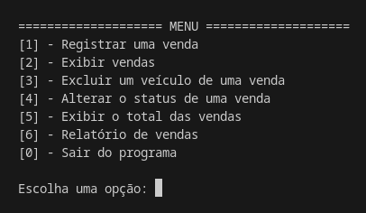
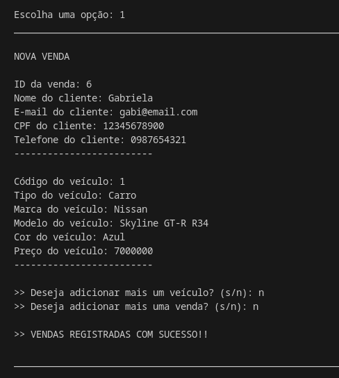
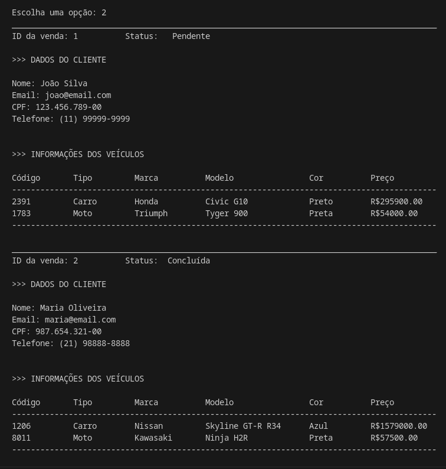
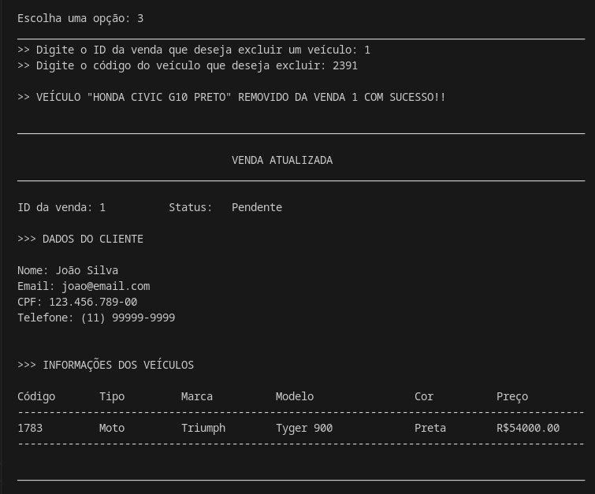
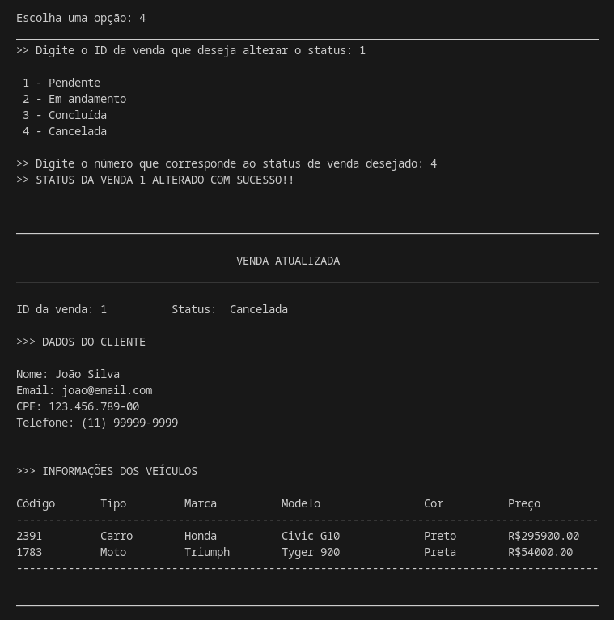
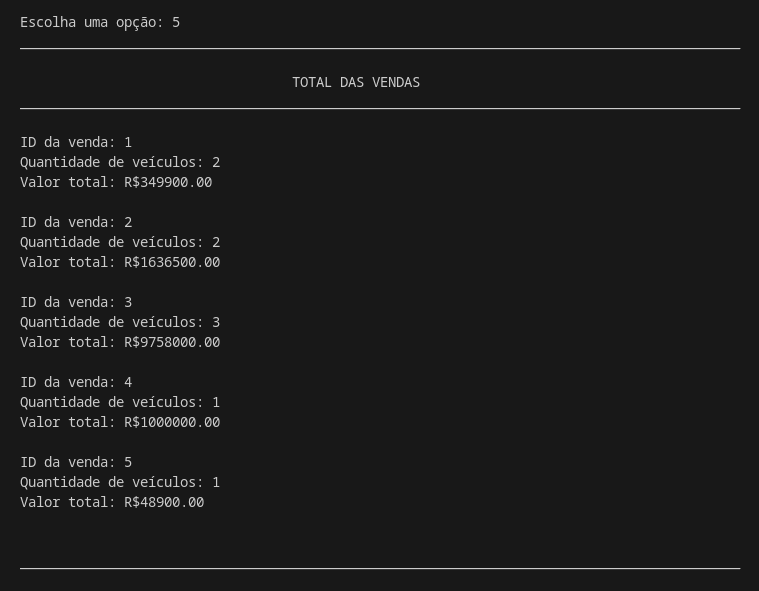
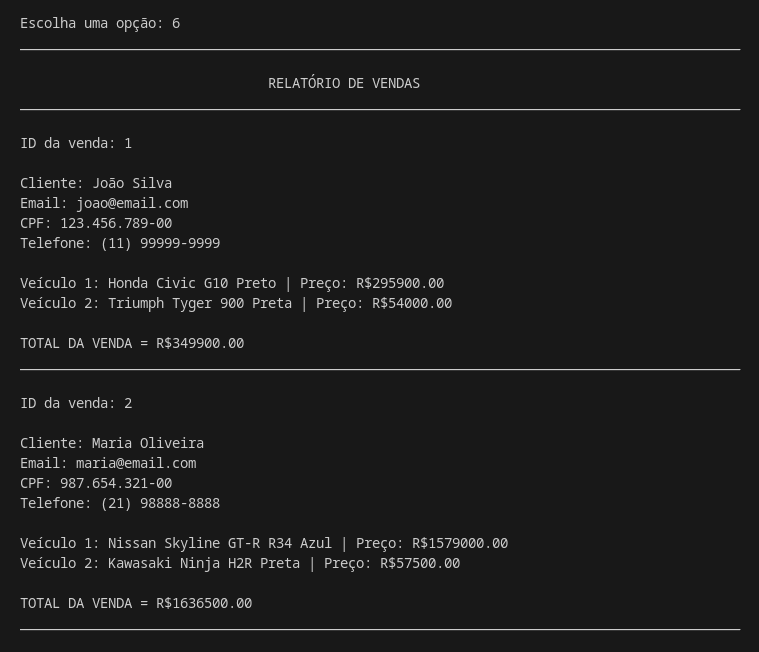
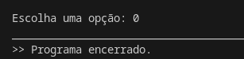

# Projeto de Gestão de Vendas para Concessionária

Este projeto implementa um sistema de gestão de vendas para uma concessionária de veículos, permitindo o cadastro, consulta e gestão de vendas de carros e motos.

## Linguagens e Tecnologias Utilizadas

- JavaScript (para a lógica de programação)
- Node.js (implementação do sistema)

## Como executar o código?

1 . Abra o terminal e certifique-se de ter o Node.js instalado na sua máquina.

``` 
node -v
```

2 . Execute o seguinte comando para clonar o repositório:

```
git clone https://github.com/gabiihdev/Projeto_Concessionaria.git
```

3 . Acesse o diretório do projeto:

```
cd Projeto_Concessionaria
```

4 . Execute o código:

```
node concessionaria.js
```

Após a execução, o sistema abrirá o seguinte menu interativo para gestão das vendas:



## Funcionalidades

### 1 . Registrar uma venda

-> Permite o cadastro de uma nova venda no sistema.



### 2 . Exibir vendas

-> Mostra a lista de todas as vendas cadastradas no sistema.



Caso não haja vendas registradas, a seguinte mensagem será exibida:

```
>> NENHUMA VENDA REGISTRADA.
```

### 3 . Excluir um veículo de uma venda

-> Busca a venda pelo ID e permite remover um veículo pelo código.



Caso a venda não seja encontrada, a seguinte mensagem será exibida:

```
>> VENDA "ID DA VENDA" NÃO ENCONTRADA.
```

Caso o veículo não seja encontrado, a seguinte mensagem será exibida:

```
>> VEÍCULO "CÓDIGO DO VEÍCULO" NÃO ENCONTRADO.
```

### 4 . Alterar o status de uma venda

-> O usuário pode alterar o status de uma venda para uma das seguintes opções: Pendente, Em andamento, Concluída, Cancelada.



Caso a venda não seja encontrada, a seguinte mensagem será exibida:

```
>> VENDA "ID DA VENDA" NÃO ENCONTRADA.
```

Caso o usuário escolha uma opção diferente das apresentadas, a seguinte mensagem será exibida:

```
>> OPÇÃO INVÁLIDA.
```

### 5 . Exibir o total de vendas

-> Calcula a quantidade de veículos e o valor total de cada venda.





### 6 . Relatório de vendas

-> Exibe um relatório detalhado das vendas realizadas, incluindo informações sobre clientes, veículos e valores totais.



### 0 . Sair do programa

-> Permite ao usuário encerrar a execução do sistema.



## Contribuição

Sinta-se à vontade para contribuir com melhorias para este projeto.